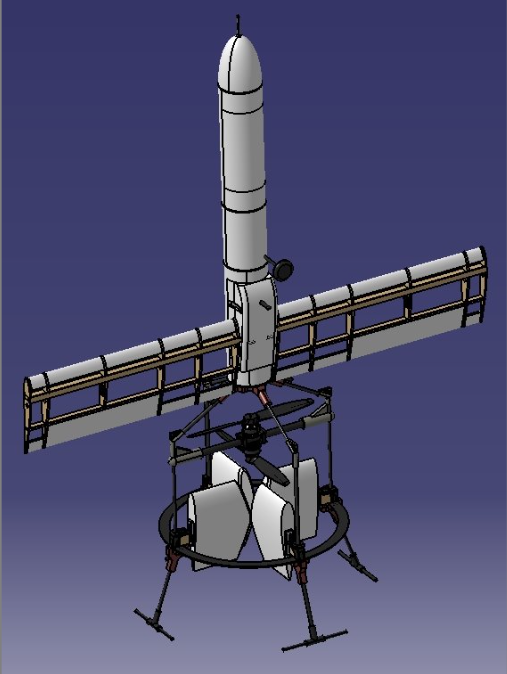
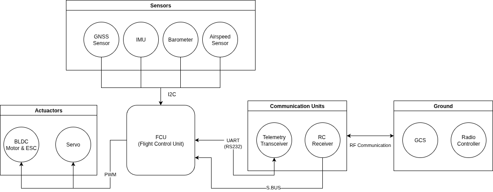
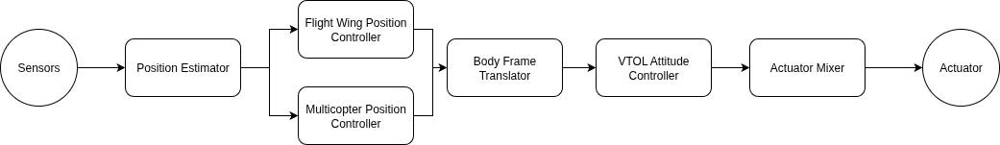
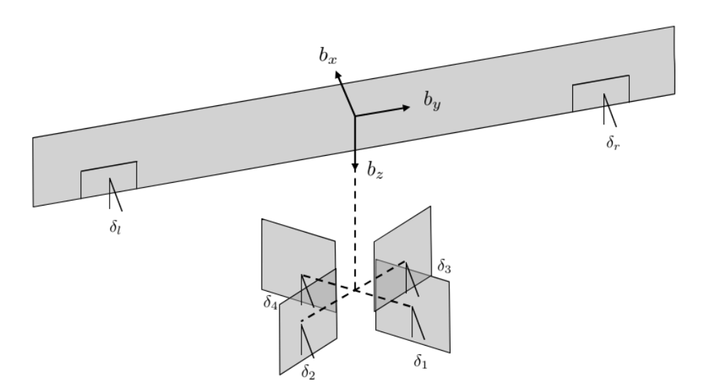
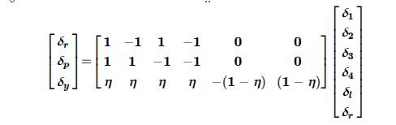

# PX4 Drone Autopilot
* <b> PX4 ver. 1.14.0 의 펌웨어 기반의 동축반전 듀얼로터형 VTOL UAV 개발
* 제21회 한국로봇항공기 대회 기술지원대상 선정
* 원본 소스코드 : [PX4](https://github.com/PX4/PX4-Autopilot/) (License: BSD 3-clause, [LICENSE](https://github.com/PX4/PX4-Autopilot/blob/master/LICENSE))
</b>
## 개요
* VTOL UAV의 추력 시스템 간소화를 위한 동축반전 듀얼로터형 추력 시스템 운용
* 주익, 동체의 모듈화를 통한 이동 편의성 및 정비성 확보
* PX4 오픈소스 펌웨어 기반 FCU 개발로 SW 개발 편의성 확보

  

## 팀 구성
|이름 | 역할 |
|-|-|
|<b>이수<b/>| 팀장, 제어SW 개발|
| 김동해 | 형상 설계, 공력 해석|
| 이규상 | 구조 설계 및 해석|
| 이종령 | 구조 설계 및 해석|
| 장동인 | 제어SW 개발|
| 황기연 | 형상 설계, 공력 해석|

## 시스템 아키텍처

### 하드웨어 아키텍처
* Pixhawk Board의 Hardware Wiring 규칙에 따라 시스템을 구성함

  

### 소프트웨어 아키텍처
* PX4의 Software Architecture에 따라 소프트웨어를 구성함
* 참고페이지: [PX4 Developer Guide](https://docs.px4.io/main/en/concept/architecture.html)

  

### 비행 제어 알고리즘 아키텍처
* 기존 PX4 Flight Stack에서 동축반전 듀얼로터형 추력 시스템에 최적화하여 알고리즘을 구성함
* Flight Wing의 Euler Angle PID, Multicopter의 Quaternions PD Controller를
  Quaternions PD Controller로 통일하여 모듈 개발

  

### 액추에이터 제어 할당
* PX4 Psuedo Inverse Control Allocation 기능을 통한 액추에이터 제어 할당 기능 구성

  
  

## 개발 결과 및 비행 영상
* [호버링 비행](https://www.youtube.com/watch?v=cjG3TfBlr3c)

  

* [천이 및 크루징 비행](https://www.youtube.com/watch?v=r4pCtxrHMMg)

  

